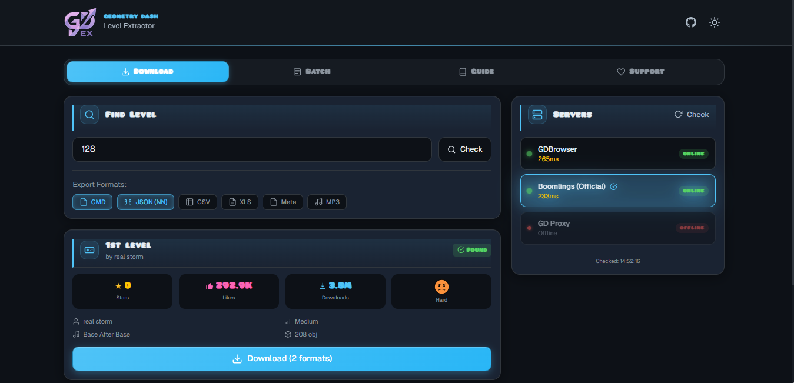

<div align="center">

# GDEX

Web tool that downloads Geometry Dash levels and exports them in multiple formats.  
Includes batch queue, multi-server failover, and rate-limited routes out of the box.

[](https://nextjs.org/)
[](https://react.dev/)
[](https://www.typescriptlang.org/)
[](https://tailwindcss.com/)
[](./LICENSE)
[](https://github.com/mapa3m-dev/gdex/stargazers)

[English](./README.md) · [Русский](./README.ru.md)

<br/>



</div>

---

## Table of Contents

- [What is this](#what-is-this)
- [What it does](#what-it-does)
- [Output formats](#output-formats)
- [Install and run](#install-and-run)
- [Production](#production)
- [Configuration](#configuration)
- [What the app touches](#what-the-app-touches)
- [How it works](#how-it-works)
- [Module map](#module-map)
- [Notes and limitations](#notes-and-limitations)
- [License](#license)

---

## What is this

GDEX is a web app for downloading Geometry Dash levels from RobTop's servers and exporting them in formats useful outside the game: GMD for re-import, JSON for analysis, CSV/XLS for spreadsheets, and the level's custom song as MP3.

Audience: level creators backing up their work, researchers studying GD level design, and ML practitioners building datasets of object placements.

---

## What it does

1. You enter a level ID.
2. GDEX queries GDBrowser for metadata (name, author, difficulty, stars, downloads).
3. You pick which formats you want.
4. You hit Download. The server fetches the raw level from Boomlings (or falls back to GD Proxy), decompresses it, parses the object stream, and returns structured data.
5. The browser builds the requested files from that data and offers them as downloads.

For multiple levels, the Batch tab accepts a list (or a range like `128-200`), runs the same flow for each, and shows progress per item. Failed items can be retried individually.

---

## Output formats

### GMD

XML plist matching the in-game `.gmd` format. Drop into the Geometry Dash editor's Import dialog to recreate the level locally. Contains the full decoded level string, not a preview.

### JSON

Structured snapshot with metadata, header settings, the first 100 objects sorted by X position, and aggregate stats (object counts, dimensions, top object types). Suitable for sequence models or general analysis.

### CSV / XLS

Object-by-object dump with all properties as columns. CSV opens in any spreadsheet tool. XLS is tab-separated with the Excel MIME type, so Excel opens it natively without an import wizard.

### Metadata

Just the level info block as JSON: author, difficulty, song, upload and update dates, coin count, verification flags. No object data.

### MP3

The level's custom song, served from its original Newgrounds URL. Falls through silently if the song is geo-blocked or no longer hosted.

> Object data is capped at the first 100 objects per level for the JSON, CSV, and XLS exports. The full decoded level string is included only in the GMD output.

---

## Install and run

```sh
bun install
bun dev
```

Dev server runs at `http://localhost:3000` with Turbopack.

**Requirements:** Bun ≥ 1.0 or Node ≥ 20.9 with npm.

---

## Production

```sh
bun build
bun start
```

The build produces a `.next/standalone/` directory ready to drop on any Node host. `next.config.ts` has `output: "standalone"` so dependencies are bundled into the runtime image.

### Vercel

Push to GitHub, import the repo on Vercel. Framework preset auto-detects as Next.js. No further configuration required.

### Self-host

```sh
bun run build
node .next/standalone/server.js
```

Serves on `PORT` (default `3000`).

---

## Configuration

GDEX has no required environment variables. All defaults are baked in.

The Geometry Dash client secret used to authenticate against Boomlings is a publicly known constant — the same value across every Geometry Dash client release. It lives in [`lib/constants.ts`](./lib/constants.ts) as `GD_CLIENT_SECRET`, not in env.

Tunable constants in source:

| Constant | Default | File |
|---|---|---|
| `MAX_LEVEL_ID_LENGTH` | `12` | `app/api/check/route.ts`, `app/api/download/route.ts` |
| `MAX_RAW_BYTES` | `10485760` (10 MB) | `app/api/download/route.ts` |
| `MAX_DECODED_BYTES` | `67108864` (64 MB) | `app/api/download/route.ts` |
| Rate limits | `30/min`, `12/min`, `10/min` | `app/api/check/route.ts`, `app/api/servers/route.ts`, `app/api/download/route.ts` |

---

## What the app touches

> [!IMPORTANT]
>
> | | |
> |---|---|
> | Talks to | `gdbrowser.com`, `boomlings.com`, `gdproxy.net` |
> | Server disk | Nothing. No database, no file storage |
> | Server RAM | In-memory rate-limit buckets, transient level buffers during a request |
> | Browser localStorage | Theme preference (`theme: "dark" \| "light"`) |
> | Outbound network | HTTPS to the three Geometry Dash servers above |

There are no accounts and no credentials. The Boomlings "secret" is the public Geometry Dash client constant `Wmfd2893gb7`, identical across every game release.

Server-side state is per-process and ephemeral. Restart the process and rate-limit counters reset.

To reset client state:
- Toggle theme via the header button
- Clear site data in the browser

---

## How it works

A request from the browser to `/api/download` lands in the Node runtime route. The handler validates the body, looks up the chosen server in `GD_SERVERS`, and tries it first. If the server returns a usable response (longer than 10 chars and not starting with `-1`), the handler proceeds. Otherwise it falls through to the next server in the list.

The raw response is base64 with deflate inside. `decodeLevelData` tries several zlib `windowBits` variants in turn through `zlib.inflateSync`, capped at 64 MB output to defend against decompression bombs. The decoded text is a `;`-separated stream where the first segment is the level header and the rest are object records (`,`-separated key-value pairs).

The handler returns the decoded level string, parsed object preview, header, computed stats, and the song info block when present. The exporters in `lib/exporters.ts` build the actual download files in the browser: GMD wraps the level string in a plist, CSV and XLS iterate the parsed objects, JSON re-serializes everything as one structured payload.

Rate limiting is an in-memory token-bucket map keyed by `x-forwarded-for` (or `x-real-ip`, or `"anonymous"`). Single-process only. See Notes.

The theme system avoids a flash of wrong theme by inlining a one-line script in `<head>` that reads `localStorage["theme"]` (or `prefers-color-scheme`) and sets `data-theme` before paint. `ThemeProvider` then reads that attribute as its initial state, so server and client agree on first render.

---

## Module map

<details>
<summary>Expand module map</summary>

### Routes (`app/`)

| Module | Description |
|---|---|
| `app/api/check/route.ts` | Level metadata lookup. Rate-limited 30/min. Hits GDBrowser. |
| `app/api/download/route.ts` | Level data fetch + zlib decode + parse. Rate-limited 10/min. Multi-server failover. |
| `app/api/servers/route.ts` | Parallel health check across all configured servers. Rate-limited 12/min. |
| `app/page.tsx` | App composition. Tabs, single-download flow, queue handoff, support tab. |
| `app/layout.tsx` | Root layout, font setup, pre-paint theme script. |
| `app/error.tsx` | Route-level error boundary. |
| `app/loading.tsx` | Route-level loading state. |
| `app/globals.css` | Tailwind v4 theme tokens, Pusab font face, animations. |

### Components (`components/`)

| Module | Description |
|---|---|
| `components/ui/Card.tsx` | Card primitive with header, title, content. |
| `components/ui/Button.tsx` | Button with primary, secondary, ghost, danger, success, boosty variants. |
| `components/ui/Input.tsx` | Text input with optional label and error message. |
| `components/ui/ProgressBar.tsx` | Determinate or indeterminate progress bar. |
| `components/ui/Tabs.tsx` | Tab list with sliding indicator and arrow-key navigation. |
| `components/ui/Checkbox.tsx` | Custom checkbox primitive. |
| `components/icons/index.tsx` | Inline SVG icon library. |
| `components/DifficultyIcon.tsx` | Renders the matching difficulty face from `public/icons/difficulty/`. |
| `components/DownloadQueue.tsx` | Batch tab UI: input parser, queue rows, retry, indeterminate progress. |
| `components/ServersStatus.tsx` | Server picker with pulsing online dot and latency color thresholds. |
| `components/Footer.tsx` | Footer with project, links, support sections. |
| `components/ThemeProvider.tsx` | Hydration-safe theme context backed by `localStorage` and `data-theme`. |

### Library (`lib/`)

| Module | Description |
|---|---|
| `lib/constants.ts` | `GD_SERVERS`, `GD_CLIENT_SECRET`, `EXPORT_FORMATS`, `OFFICIAL_SONGS`. |
| `lib/types.ts` | `LevelInfo`, `QueueItem`, `ServerStatus`, `ServersResponse`. |
| `lib/exporters.ts` | `makeGmd`, `objectsToCsv`, `objectsToTsv`, `generateFile`, `downloadFile`. |
| `lib/rateLimit.ts` | In-memory token-bucket with periodic sweep. |
| `lib/hooks/useDownloadQueue.ts` | Queue state and check, start, pause, retry, clear handlers. |
| `lib/hooks/useCountUp.ts` | Cubic-eased count-up animation, `formatCompact` for K/M/B. |

</details>

---

## Notes and limitations

**The rate limiter is in-memory and per-process.** Fine for single-instance deploys (Vercel default, single VM, single container). On a horizontally scaled deployment each replica enforces its own limit, so the effective ceiling becomes `replicas × limit`. Replace `lib/rateLimit.ts` with a Redis or Vercel KV backend before scaling out.

**The Geometry Dash client secret is not a secret.** `Wmfd2893gb7` is the same value embedded in every Geometry Dash release. It's stored as a constant rather than an env var to make this explicit. Hiding it in env would suggest a security property that does not exist.

**Decompression is capped at 64 MB.** `zlib.inflateSync` runs with `maxOutputLength` to defend against crafted upstream responses. Real GD levels are well under this cap. If a request hits it, the route returns 413.

**Custom song MP3 export depends on Newgrounds.** The link is fetched directly from the level's song info block. Songs uploaded to Newgrounds with regional restrictions or geo-blocks return 403 from the user's browser, and there is no server-side proxy to route around it.

**No accounts, no auth.** GDEX is fully anonymous. Nothing to sign in to, nothing to revoke, nothing stored per user beyond a theme preference in localStorage.

**The build requires network access to Google Fonts.** `next/font/google` fetches Geist and Geist Mono at build time. CI without internet access will fail. To make the build self-contained, switch to `next/font/local` and ship the WOFF2 files in `public/fonts/`.

**Stack:** Next.js 16, React 19, TypeScript 5 strict, Tailwind CSS v4, Bun. No database, no ORM, no state-management library, no UI component library.

---

## License

This project is released under the **MIT License**.

You can use, modify, distribute, sell, or sublicense the code freely, including in closed-source or commercial work. The only condition is that the original copyright notice and license text must be included with any substantial portion of the code.

The software is provided as is, with no warranty of any kind. The author is not liable for damages arising from use of the code, including data loss, downtime, or consequences of failed downloads.

Geometry Dash and all related assets are © RobTop Games AB. GDEX is not affiliated with RobTop Games. Custom song downloads originate from Newgrounds and are subject to Newgrounds' terms.

Full license text: [LICENSE](./LICENSE)
